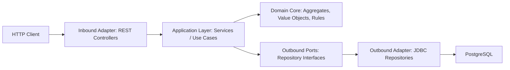

# eTorg

eTorg is a Spring Boot backend MVP for an online auction platform. The project implements user authentication, role-based user management, lot lifecycle management, bidding rules, PostgreSQL persistence, and a REST API for auction operations.

The main purpose of the project is to demonstrate backend development skills with Java, Spring Boot, Spring Security, JWT authentication, domain modeling, JDBC persistence, and Hexagonal Architecture.

## Features

- User registration and authentication
- JWT-based stateless authentication
- Role-based administration endpoints
- Lot creation and lifecycle management
- Bidding with domain-level auction rules
- Automatic lot state transition after timeout
- Cursor-based lot card queries
- Lot details with bid history
- Category lookup
- Unit tests for core auction business rules
- OpenAPI/Swagger documentation

## Tech Stack

- Java 21
- Spring Boot
- Spring Web MVC
- Spring Security
- Spring Data JPA for user persistence
- Spring JDBC for auction persistence
- PostgreSQL
- JWT
- Lombok
- JUnit 5
- Springdoc OpenAPI
- Maven

## Architecture

The project uses Hexagonal Architecture. The auction module is organized around a domain core, application services, ports, and adapters.



### Main Architectural Ideas

- The domain core contains business rules and does not depend on controllers.
- Application services coordinate use cases.
- Repository interfaces define persistence ports.
- JDBC repositories implement persistence adapters.
- REST controllers expose inbound adapters for API clients.
- Security is handled as an application boundary concern through Spring Security and JWT.

## Modules

### Lot Module

Package: `io.github.etorg.lot`

Responsible for auction behavior:

- Creating lots
- Making bids
- Closing lots
- Drawing/canceling lots
- Changing lot state after timeout
- Reading lot cards and lot details
- Publishing domain events inside the aggregate

Important classes:

- `LotAggregate` - domain aggregate with lot lifecycle and bidding rules
- `BidVO` - bid value object
- `StatusEnum` - lot states
- `LotService` - application service for lot use cases
- `ILotRepository` - command-side persistence port
- `ILotQueryRepository` - query-side persistence port
- `LotJdbcRepository` - JDBC persistence adapter for aggregates
- `LotQueryJdbcRepository` - JDBC query adapter for read models
- `LotRestController` - REST inbound adapter
- `LotScheduler` - scheduled timeout processing

### Users Module

Package: `io.github.etorg.users`

Responsible for user accounts and authentication:

- User registration
- User login
- JWT generation and validation
- Password hashing
- Role management
- Admin user operations

Important classes:

- `User` - user persistence and security model
- `UserRepository` - user repository
- `AuthenticationService` - registration and authentication use cases
- `JwtService` - JWT token generation and parsing
- `JwtFilter` - request authentication filter
- `SecutityConfig` - Spring Security configuration
- `AuthController` - authentication API
- `UserManagmentController` - admin user API

## Domain Rules

The core business rules are implemented in `LotAggregate`.

A lot is created with:

- currency
- timeout
- minimum bid
- owner
- title
- description

After creation, the lot starts in the `OPEN` state.

A bid can be placed only when:

- the lot is `OPEN`
- the timeout has not expired
- the bid currency matches the lot currency
- the bid value is greater than or equal to the current minimum allowed bid

After a successful bid, the next minimum bid is increased by 5%.

A lot can become:

- `CLOSED` when it has bids and is closed by the owner or by timeout
- `DRAW` when it has no valid winner or is canceled by the owner
- `OPEN` while bidding is active

## REST API

Full API documentation is available in:

- [API Reference](docs/API.md)
- [OpenAPI Swagger YAML](docs/openapi.yaml)

When the application is running with Springdoc enabled, Swagger UI is available at:

```text
http://localhost:8080/swagger-ui/index.html
```

## Main Endpoints

Authentication:

- `POST /api/users/authentication/signup`
- `POST /api/users/authentication/signin`

Lots:

- `PUT /api/lots/create/`
- `POST /api/lots/makebid/`
- `GET /api/lots/cards/`
- `GET /api/lots/item/{id}`
- `DELETE /api/lots/item/delete/{id}`
- `GET /api/lots/categories`

Admin:

- `POST /api/admin/users/change-role`
- `DELETE /api/admin/users/delete`

## Example Requests

### Sign Up

```http
POST /api/users/authentication/signup
Content-Type: application/json

{
  "email": "john@example.com",
  "username": "john_auction",
  "password": "Password1!"
}
```

### Sign In

```http
POST /api/users/authentication/signin
Content-Type: application/json

{
  "username": "john_auction",
  "password": "Password1!"
}
```

Response:

```json
{
  "jwt": "eyJhbGciOiJIUzI1NiJ9..."
}
```

### Create Lot

```http
PUT /api/lots/create/
Authorization: Bearer <jwt>
Content-Type: application/json

{
  "currency": "PLN",
  "timeout": "2026-08-01T18:00:00",
  "description": "Vintage mechanical watch in good condition",
  "minBid": 100.00,
  "title": "Vintage Watch"
}
```

### Make Bid

```http
POST /api/lots/makebid/
Authorization: Bearer <jwt>
Content-Type: application/json

{
  "lotId": "61b04e77-df64-4a07-b4a7-4c9d6f0ac121",
  "currency": "PLN",
  "value": 150.00
}
```

### Get Lot Cards

```http
GET /api/lots/cards/?attribute=MIN_BID&order=ASC
```

## Configuration

Application configuration is stored in:

```text
src/main/resources/application.properties
```

Required services:

- PostgreSQL database
- Java 21

Example local database configuration:

```properties
spring.datasource.url=jdbc:postgresql://localhost:5432/etorg
spring.datasource.username=postgres
spring.datasource.password=your_password
```

## Running Locally

```bash
./mvnw spring-boot:run
```

On Windows:

```bash
mvnw.cmd spring-boot:run
```

The API will be available at:

```text
http://localhost:8080
```

## Tests

Run tests:

```bash
./mvnw test
```

The project includes unit tests for the main auction aggregate rules.

## Project Status

This is an MVP pet project created to practice and demonstrate backend development with Java and Spring Boot. The project focuses on clean domain modeling, Hexagonal Architecture, JWT authentication, persistence, and REST API design.

## Roadmap

- Docker Compose setup for PostgreSQL
- Database migrations with Flyway or Liquibase
- More integration tests
- More detailed API validation and error responses
- WebSocket notifications for live bidding
- CI pipeline
