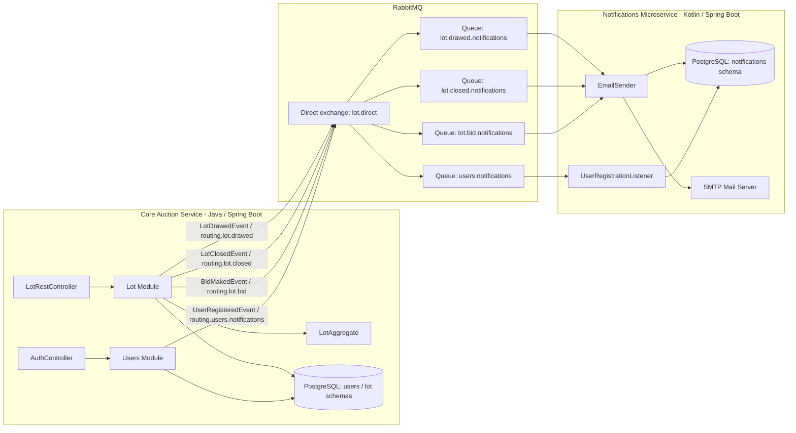
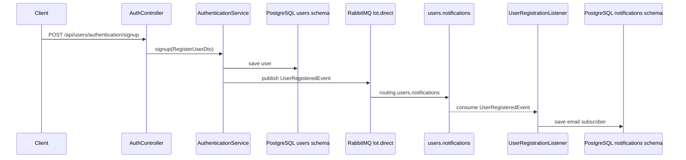
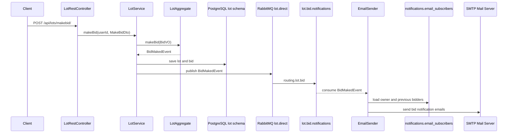
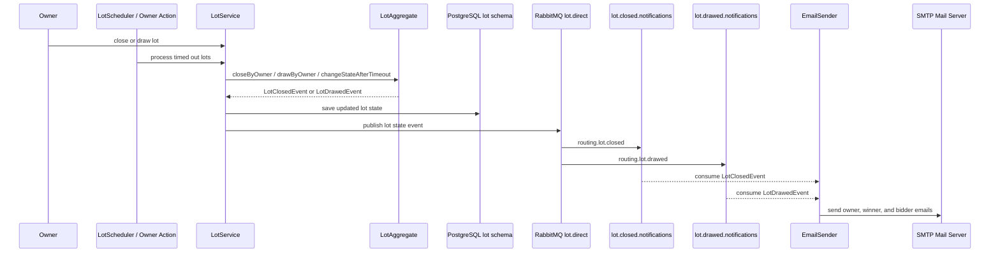

# eTorg

eTorg is an event-driven backend MVP for an online auction platform. The system consists of a Java Spring Boot core service and a Kotlin Spring Boot notification microservice connected through RabbitMQ.

Business processes, UML diagrams, domain rules, and functional notification requirements are documented in [Business Processes and UML Diagrams](docs/BUSINESS_PROCESSES.md).

The project implements user authentication, role-based user management, lot lifecycle management, bidding rules, PostgreSQL persistence, database migrations, asynchronous domain events, email notifications, and a REST API for auction operations.

The main purpose of the project is to demonstrate backend development skills with Java, Kotlin, Spring Boot, Spring Security, JWT authentication, RabbitMQ, domain modeling, JDBC persistence, Flyway migrations, and Hexagonal Architecture.

## Features

- User registration and authentication
- JWT-based stateless authentication
- Role-based administration endpoints
- Lot creation and lifecycle management
- Bidding with domain-level auction rules
- Automatic lot state transition after timeout
- RabbitMQ-based domain event publishing
- Kotlin notification microservice
- Email notifications for registration, bids, and lot state changes
- Cursor-based lot card queries
- Lot details with bid history
- Category lookup
- Flyway database migrations
- Unit tests for core auction business rules
- OpenAPI/Swagger documentation

## Tech Stack

- Java 21
- Kotlin
- Spring Boot
- Spring Web MVC
- Spring Security
- Spring Data JPA for user persistence
- Spring JDBC for auction persistence
- PostgreSQL
- RabbitMQ
- Spring AMQP
- Flyway
- Spring Mail
- JWT
- Lombok
- JUnit 5
- Springdoc OpenAPI
- Maven

## Architecture

eTorg is split into two Spring Boot services: the core auction backend and a separate Kotlin notification microservice. The core service owns users, lots, bids, and auction rules. The notification microservice listens to RabbitMQ events and sends email notifications asynchronously through an SMTP provider such as Ethereal.



## Modules

### Core Auction Service

Location: project root

Technology: Java, Spring Boot

Responsible for the main auction system:

- REST API
- Authentication and authorization
- User management
- Lot and bid business logic
- Domain event publishing
- PostgreSQL persistence
- Flyway migrations for core tables

### Lot Module

Package: `io.github.etorg.lot`

Responsible for auction behavior:

- Creating lots
- Making bids
- Closing lots
- Drawing/canceling lots
- Changing lot state after timeout
- Reading lot cards and lot details
- Publishing domain events inside the aggregate
- Publishing lot events to RabbitMQ

Important classes:

- `LotAggregate` - domain aggregate with lot lifecycle and bidding rules
- `BidVO` - bid value object
- `StatusEnum` - lot states
- `LotService` - application service for lot use cases
- `ILotRepository` - command-side persistence port
- `ILotQueryRepository` - query-side persistence port
- `LotJdbcRepository` - JDBC persistence adapter for aggregates
- `LotQueryJdbcRepository` - JDBC query adapter for read models
- `LotRestController` - REST inbound adapter
- `LotScheduler` - scheduled timeout processing
- `MessageBrokerConfiguration` - RabbitMQ exchange and JSON message converter configuration

### Users Module

Package: `io.github.etorg.users`

Responsible for user accounts and authentication:

- User registration
- User login
- JWT generation and validation
- Password hashing
- Role management
- Admin user operations
- Publishing user registration events to RabbitMQ

Important classes:

- `User` - user persistence and security model
- `UserRepository` - user repository
- `AuthenticationService` - registration and authentication use cases
- `JwtService` - JWT token generation and parsing
- `JwtFilter` - request authentication filter
- `SecutityConfig` - Spring Security configuration
- `AuthController` - authentication API
- `UserManagmentController` - admin user API

### Notifications Microservice

Location: `notifications-microservice`

Technology: Kotlin, Spring Boot

The project includes a dedicated notification microservice written in Kotlin. It is separated from the core auction service so that user registration, bidding, and lot lifecycle operations do not have to send emails directly inside the main request flow.

The service communicates with the core backend through RabbitMQ. The core service publishes domain events to the `lot.direct` exchange, and the notification microservice receives them from dedicated queues.

Responsible for:

- Receiving domain events from RabbitMQ
- Storing email subscribers
- Sending email notifications through Spring Mail
- Using Ethereal SMTP for development email testing
- Handling user registration events
- Handling bid events
- Handling lot closed events
- Handling lot draw events
- Managing its own Flyway migrations

RabbitMQ subscriptions:

- `users.notifications` receives `UserRegisteredEvent`
- `lot.bid.notifications` receives `BidMakedEvent`
- `lot.closed.notifications` receives `LotClosedEvent`
- `lot.drawed.notifications` receives `LotDrawedEvent`

Notification behavior:

- When a user registers, `UserRegistrationListener` stores the user as an email subscriber.
- When a bid is made, `EmailSender` notifies the lot owner and previous bidders.
- When a lot is closed, `EmailSender` notifies the owner, winner, and other bidders.
- When a lot is drawn/canceled, `EmailSender` notifies the owner and bidders.

Persistence:

- The microservice has its own Flyway migrations.
- Notification data is stored in the `notifications` PostgreSQL schema.
- Subscribers are stored in the `email_subscribers` table.

Important classes:

- `NotificationsApplication` - microservice entry point
- `MessageBrokerConfiguration` - RabbitMQ queues, bindings, exchange, and JSON converter
- `UserRegistrationListener` - handles user registration events
- `EmailSender` - handles lot-related notification events and sends emails
- `IEmailSubscribersRepository` - subscriber persistence repository
- `EmailSubscribersEntity` - notification subscriber entity
- `DatabaseConfiguration` - Flyway migration configuration for the `notifications` schema

## Event-Driven Communication

The core service publishes domain events to RabbitMQ. The notification microservice consumes these events and sends emails asynchronously.

### User Registration Event Flow



### Bid Notification Flow



### Lot State Change Notification Flow



RabbitMQ exchange:

- `lot.direct`

Queues:

- `users.notifications`
- `lot.bid.notifications`
- `lot.closed.notifications`
- `lot.drawed.notifications`

Routing keys:

- `routing.users.notifications`
- `routing.lot.bid`
- `routing.lot.closed`
- `routing.lot.drawed`

## Domain Rules

The core business rules are implemented in `LotAggregate`.

A lot is created with:

- currency
- timeout
- minimum bid
- owner
- title
- description

After creation, the lot starts in the `OPEN` state.

A bid can be placed only when:

- the lot is `OPEN`
- the timeout has not expired
- the bid currency matches the lot currency
- the bid value is greater than or equal to the current minimum allowed bid

After a successful bid, the next minimum bid is increased by 5%.

A lot can become:

- `CLOSED` when it has bids and is closed by the owner or by timeout
- `DRAW` when it has no valid winner or is canceled by the owner
- `OPEN` while bidding is active

## REST API

Full API documentation is available in:

- [API Reference](docs/API.md)
- [OpenAPI Swagger YAML](docs/openapi.yaml)

When the application is running with Springdoc enabled, Swagger UI is available at:

```text
http://localhost:8080/swagger-ui/index.html
```

## Main Endpoints

Authentication:

- `POST /api/users/authentication/signup`
- `POST /api/users/authentication/signin`

Lots:

- `PUT /api/lots/create/`
- `POST /api/lots/makebid/`
- `GET /api/lots/cards/`
- `GET /api/lots/item/{id}`
- `DELETE /api/lots/item/delete/{id}`
- `GET /api/lots/categories`

Admin:

- `POST /api/admin/users/change-role`
- `DELETE /api/admin/users/delete`

## Example Requests

### Sign Up

```http
POST /api/users/authentication/signup
Content-Type: application/json

{
  "email": "john@example.com",
  "username": "john_auction",
  "password": "Password1!"
}
```

### Sign In

```http
POST /api/users/authentication/signin
Content-Type: application/json

{
  "username": "john_auction",
  "password": "Password1!"
}
```

Response:

```json
{
  "jwt": "eyJhbGciOiJIUzI1NiJ9..."
}
```

### Create Lot

```http
PUT /api/lots/create/
Authorization: Bearer <jwt>
Content-Type: application/json

{
  "currency": "PLN",
  "timeout": "2026-08-01T18:00:00",
  "description": "Vintage mechanical watch in good condition",
  "minBid": 100.00,
  "title": "Vintage Watch"
}
```

### Make Bid

```http
POST /api/lots/makebid/
Authorization: Bearer <jwt>
Content-Type: application/json

{
  "lotId": "61b04e77-df64-4a07-b4a7-4c9d6f0ac121",
  "currency": "PLN",
  "value": 150.00
}
```

### Get Lot Cards

```http
GET /api/lots/cards/?attribute=MIN_BID&order=ASC
```

## Configuration

Core service configuration is stored in:

```text
src/main/resources/application.properties
```

Notification microservice configuration is stored in:

```text
notifications-microservice/src/main/resources/application.properties
```

Required services:

- PostgreSQL database
- RabbitMQ
- SMTP-compatible mail server
- Java 21
- Kotlin-compatible Maven build

Example local database configuration:

```properties
spring.datasource.url=jdbc:postgresql://localhost:5432/etorg
spring.datasource.username=postgres
spring.datasource.password=your_password
```

## Database Migrations

The project uses Flyway migrations for database schema management.

Core service migrations:

```text
src/main/resources/db/migration/lot
src/main/resources/db/migration/users
```

Notification microservice migrations:

```text
notifications-microservice/src/main/resources/db/migration
```

The notification service manages its own `notifications` schema and subscriber table.

## Running Locally

Run the core auction service:

```bash
./mvnw spring-boot:run
```

On Windows:

```bash
mvnw.cmd spring-boot:run
```

The API will be available at:

```text
http://localhost:8080
```

Run the notification microservice:

```bash
cd notifications-microservice
./mvnw spring-boot:run
```

On Windows:

```bash
cd notifications-microservice
mvnw.cmd spring-boot:run
```

The notification microservice runs on:

```text
http://localhost:8081
```

## Tests

Run tests:

```bash
./mvnw test
```

The project includes unit tests for the main auction aggregate rules. The notification microservice also contains a Spring Boot test entry point.

## Project Status

This is an MVP pet project created to practice and demonstrate backend development with Java, Kotlin, Spring Boot, RabbitMQ, PostgreSQL, and Hexagonal Architecture. The project focuses on clean domain modeling, asynchronous communication, JWT authentication, persistence, database migrations, and REST API design.

## Roadmap

- Docker Compose setup for PostgreSQL
- Docker Compose setup for RabbitMQ and mail testing
- More integration tests
- More detailed API validation and error responses
- WebSocket notifications for live bidding
- Transactional outbox for reliable event publishing
- CI pipeline
