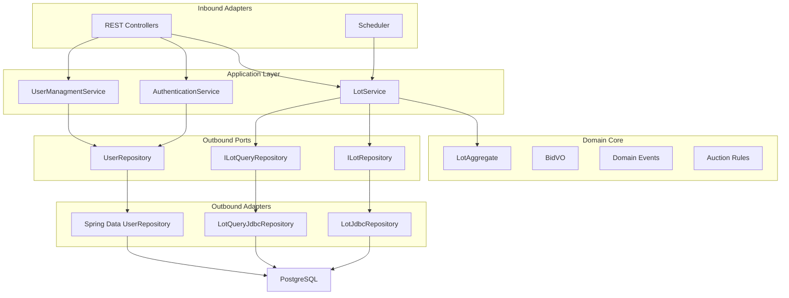
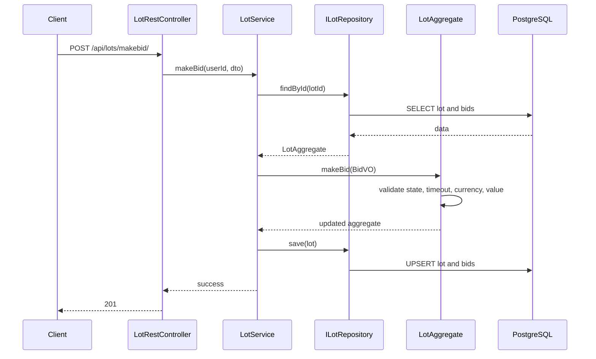

# Architecture

eTorg uses Hexagonal Architecture. The codebase separates the auction business rules from transport and persistence details by organizing the project around domain objects, application services, ports, and adapters.

## High-Level View

## Domain Core

The domain core contains the auction model and rules. It is centered around `LotAggregate`.

Responsibilities:

- Maintain lot state
- Validate bids
- Enforce currency rules
- Enforce timeout rules
- Close lots
- Draw/cancel lots
- Produce domain events

Main classes:

- `LotAggregate`
- `BidVO`
- `StatusEnum`
- `DomainLotException`
- `DomainBidVOException`
- `BidMakedEvent`
- `LotClosedEvent`
- `LotDrawedEvent`

## Application Layer

Application services coordinate use cases. They receive DTOs from inbound adapters, load aggregates through ports, execute domain methods, and save the result.

Main classes:

- `LotService`
- `AuthenticationService`
- `UserManagmentService`

Example lot use cases:

- create lot
- make bid
- close lot by owner
- draw lot by owner
- read lot cards
- read lot details
- delete lot
- get categories

## Ports

Ports define what the application layer needs from external systems.

### `ILotRepository`

Command-side persistence port for `LotAggregate`.

Operations:

- find lot by id
- find lots with expired timeout
- save one aggregate
- save multiple aggregates
- delete lot

### `ILotQueryRepository`

Query-side persistence port for read models.

Operations:

- get sorted lot cards
- get lot details
- get categories

## Adapters

Adapters connect the application to the outside world.

### Inbound Adapters

- `LotRestController` exposes lot operations over HTTP.
- `AuthController` exposes signup and signin endpoints.
- `UserManagmentController` exposes admin user operations.
- `LotScheduler` triggers timeout-based lot state changes.

### Outbound Adapters

- `LotJdbcRepository` persists and restores auction aggregates.
- `LotQueryJdbcRepository` builds read models for API responses.
- `UserRepository` persists users through Spring Data JPA.

## Module Overview

### Lot Module

The lot module contains the auction business logic and persistence adapters. It is the main domain module of the system.

Package roots:

- `io.github.etorg.lot.api`
- `io.github.etorg.lot.internal.domain`
- `io.github.etorg.lot.internal.service`
- `io.github.etorg.lot.internal.infrastructure`

### Users Module

The users module contains authentication and user management logic.

Package roots:

- `io.github.etorg.users.api`
- `io.github.etorg.users.service`
- `io.github.etorg.users.security`
- `io.github.etorg.users.infrastructure`
- `io.github.etorg.users.models`

## Request Flow: Make Bid

## Design Goals

- Keep auction rules inside the domain model.
- Keep controllers thin.
- Keep persistence behind repository ports.
- Separate command-side aggregate persistence from query-side read models.
- Make the codebase easy to explain during technical interviews.
