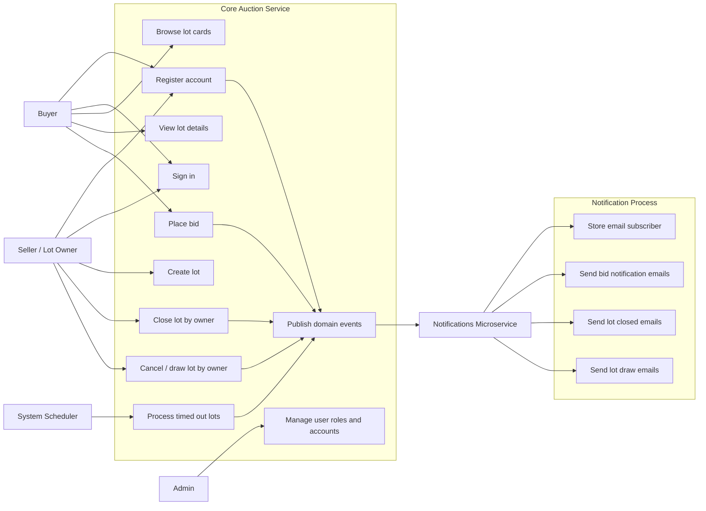
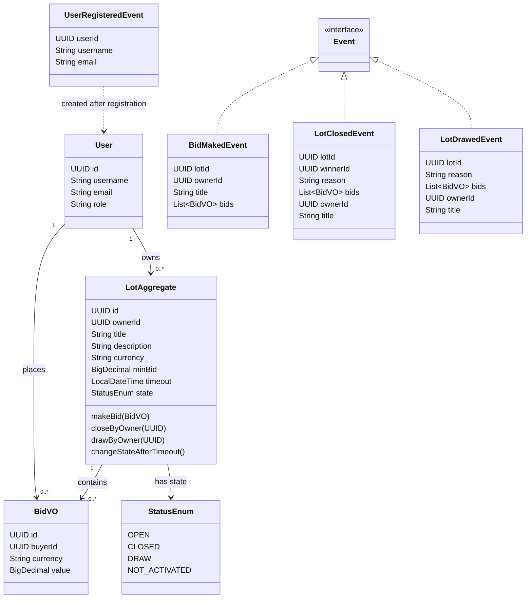
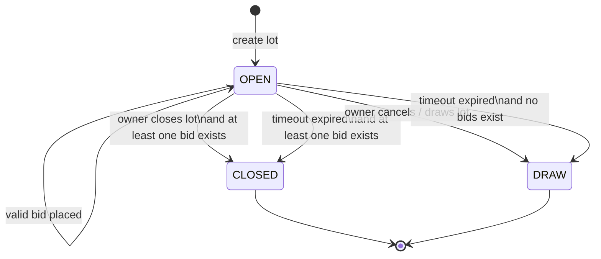
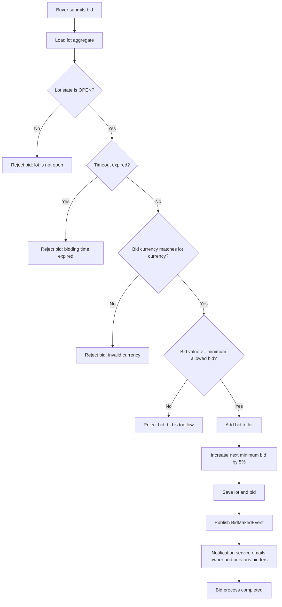
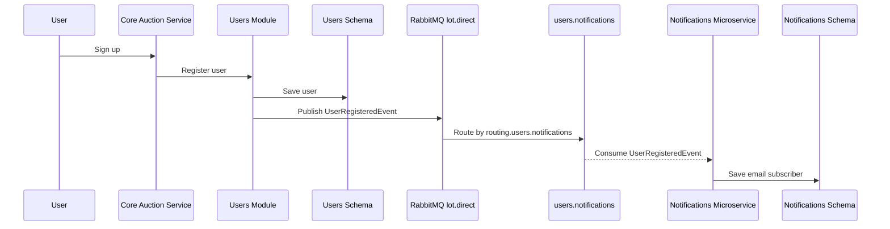
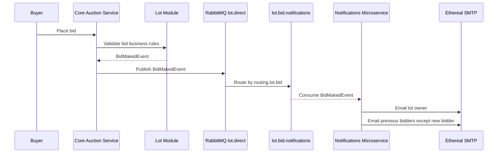
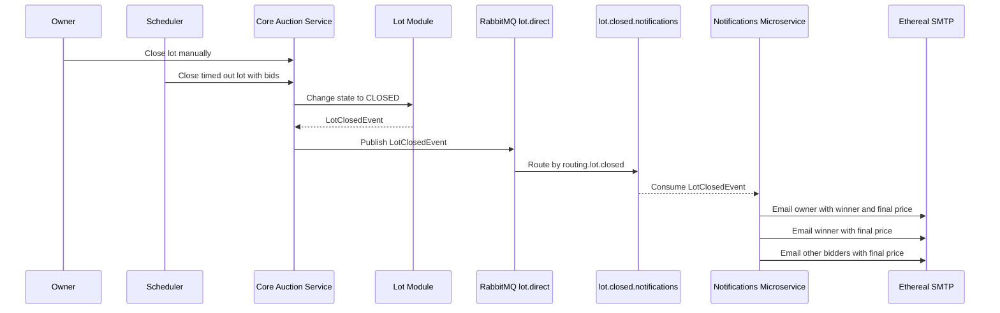
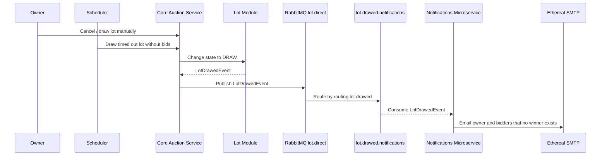

# Business Processes and UML Diagrams

This document describes the main business processes, domain rules, and notification requirements of eTorg. It is intended to show the system from a business analysis perspective: actors, use cases, lot lifecycle, bidding rules, notification flows, and traceability between functional requirements and implemented behavior.

## Business Context

eTorg is an online auction system. A seller creates a lot, buyers place bids, and the system determines whether the lot is closed with a winner or drawn without a winner. The core auction service owns users, lots, bids, and domain rules. The notification microservice receives RabbitMQ events and sends email notifications to subscribed users.

## Actors and Use Cases

## Domain Model

## Lot Lifecycle State Machine

### Lot Lifecycle Rules

| ID | Rule |
| --- | --- |
| LOT-1 | A lot is created with currency, end time, and minimum bid. After creation it is `OPEN`. |
| LOT-2 | A bid can be placed only when the lot is `OPEN`, the currency matches, and the bid satisfies the minimum allowed value. |
| LOT-3 | A lot becomes `CLOSED` when it has at least one bid and is closed by the owner or by timeout. |
| LOT-4 | A lot becomes `DRAW` when it is canceled by the owner or timeout expires without bids. |
| LOT-INV-1 | The lot end time cannot be earlier than now and cannot be later than 6 months from creation. |
| LOT-INV-2 | A lot must always be in a valid state: `OPEN`, `CLOSED`, or `DRAW`. |

## Bid Placement Business Process

## User Registration Notification Flow

## Bid Notification Flow

## Lot Closed Notification Flow

## Lot Draw Notification Flow

## Notification Functional Requirements

The following requirements are based on `notifications-microservice/functional requirements lot - notifications.txt`.

| ID | Requirement | Event / Queue |
| --- | --- | --- |
| LOT-FR-1 | Every lot status change or new bid must notify subscribed users who placed bids on the lot and the lot owner. Each lot email includes lot link and lot title. | `BidMakedEvent`, `LotClosedEvent`, `LotDrawedEvent` |
| LOT-FR-2 | When a lot is closed, the owner receives winner username and final sale price; the winner receives the final sale price; other bidders receive closure information and final price. | `LotClosedEvent` / `lot.closed.notifications` |
| LOT-FR-3 | When a new bid is placed, previous bidders except the new bidder and the lot owner receive the new bidder username and bid amount. | `BidMakedEvent` / `lot.bid.notifications` |
| LOT-FR-4 | If the auction ends without a winner, the owner and bidders receive an email stating that nobody won. | `LotDrawedEvent` / `lot.drawed.notifications` |

## Requirement Traceability

| Business Rule / Requirement | Implemented By | Documentation Diagram |
| --- | --- | --- |
| Lot lifecycle states | `LotAggregate`, `StatusEnum` | Lot Lifecycle State Machine |
| Bid validation | `LotAggregate.makeBid`, `BidVO` | Bid Placement Business Process |
| User registration notification | `AuthenticationService`, `UserRegisteredEvent`, `UserRegistrationListener` | User Registration Notification Flow |
| Bid notification | `BidMakedEvent`, `EmailSender` | Bid Notification Flow |
| Lot closed notification | `LotClosedEvent`, `EmailSender` | Lot Closed Notification Flow |
| Lot draw notification | `LotDrawedEvent`, `EmailSender` | Lot Draw Notification Flow |
